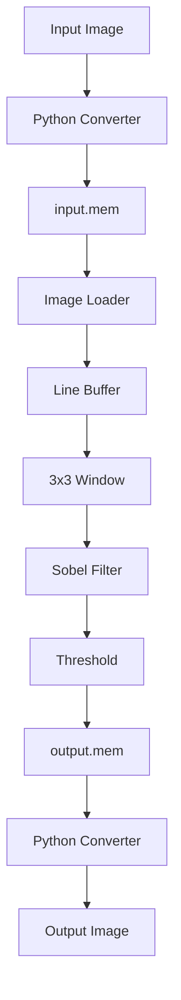

🚀 Verilog HDL Implementation of Hardware Accelerator for Sobel Edge Detection
```{=html}
<p align="center">
```
``{=html}
```{=html}
</p>
```
```{=html}
<p align="center">
```


```{=html}
</p>
```
> A complete hardware implementation of the Sobel Edge Detection
> algorithm using **Verilog HDL**. This project demonstrates an
> image-processing pipeline that reads a grayscale image from memory,
> generates a sliding 3×3 window, computes Sobel gradients (Gx and Gy),
> performs thresholding, and produces an edge-detected output image. The
> design is verified through **Xilinx Vivado Behavioral Simulation**.
---
📖 Table of Contents
Project Overview
Objectives
Features
Hardware Architecture
Data Flow
Repository Structure
Module Description
Sobel Operator
Project Workflow
Simulation Results
Screenshots
How to Run
Applications
Future Improvements
Tools Used
References
Author
---
📌 Project Overview
Edge detection is one of the fundamental operations in digital image
processing. Software implementations are computationally expensive for
real-time applications. This project accelerates the process by
implementing the Sobel operator completely in hardware using Verilog
HDL.
The accelerator accepts an image converted into a memory file, streams
pixels through a hardware pipeline, computes gradients using the Sobel
kernels, detects edges using thresholding, and reconstructs the
processed image after simulation.
---
🎯 Objectives
Implement Sobel Edge Detection in Verilog HDL.
Design a modular hardware pipeline.
Read image pixels from memory.
Generate a 3×3 sliding window.
Compute horizontal and vertical gradients.
Apply thresholding.
Verify functionality using Xilinx Vivado.
Convert simulation output back into an image.
---
✨ Features
Modular RTL Design
Streaming Pixel Processing
Sobel Gx & Gy Convolution
Threshold-based Edge Detection
Vivado Simulation
Python Image Conversion Utilities
Memory-based Image Processing
---
🏗 Hardware Architecture
```{=html}
<p align="center">
```
``{=html}
```{=html}
</p>
```
``` text
Input Image
      │
      ▼
Python Image Converter
      │
      ▼
 input.mem
      │
      ▼
Image Loader
      │
      ▼
Line Buffer
      │
      ▼
3×3 Window Generator
      │
      ▼
Sobel Filter
      │
      ▼
Threshold
      │
      ▼
Output Memory
      │
      ▼
Python Converter
      │
      ▼
Output Image
```
---
🔄 Data Flow

---
📂 Repository Structure
``` text
RTL/
│── image_loader.v
│── line_buffer.v
│── sobel_filter.v
│── threshold.v
│── top.v

Testbench/
│── tb_top.v

Python/
│── image_to_mem.py
│── mem_to_image.py

Memory/
│── input.mem
│── output.mem

Images/
│── architecture.png
│── input.png
│── output.png
│── waveform.png
│── rtl_schematic.png
│── behavioral_simulation.png
│── timing_simulation.png

README.md
LICENSE
.gitignore
```
---
⚙ RTL Modules
Module           Function
---
image_loader.v   Reads pixels sequentially from memory
line_buffer.v    Stores previous image rows
sobel_filter.v   Computes Gx, Gy and gradient magnitude
threshold.v      Produces binary edge output
top.v            Connects all modules
tb_top.v         Testbench for simulation
---
🧠 Sobel Operator
Horizontal Kernel (Gx)
``` text
-1  0 +1
-2  0 +2
-1  0 +1
```
Vertical Kernel (Gy)
``` text
+1 +2 +1
 0  0  0
-1 -2 -1
```
Gradient Magnitude
``` text
|Gx| + |Gy|
```
---
🚀 Project Workflow
Convert grayscale image into `input.mem`.
Load memory file into Verilog design.
Feed pixels into the image loader.
Generate a sliding 3×3 pixel window.
Compute horizontal and vertical gradients.
Calculate edge magnitude.
Apply threshold.
Store output in `output.mem`.
Convert memory back to an output image.
---
📸 Screenshots
Input Image
```{=html}
<p align="center">
```
``{=html}
```{=html}
</p>
```
---
RTL Schematic
```{=html}
<p align="center">
```
``{=html}
```{=html}
</p>
```
---
Behavioral Simulation
```{=html}
<p align="center">
```
``{=html}
```{=html}
</p>
```
---
Waveform
```{=html}
<p align="center">
```
``{=html}
```{=html}
</p>
```
---
Timing Simulation
```{=html}
<p align="center">
```
``{=html}
```{=html}
</p>
```
---
Output Image
```{=html}
<p align="center">
```
``{=html}
```{=html}
</p>
```
---
▶️ How to Run
``` bash
git clone https://github.com/Hanshitha07/Verilog-HDL-Implementation-of-Hardware-Accelerator-for-Sobel-Edge-Detection.git
```
Convert Image
``` bash
python image_to_mem.py
```
Open Vivado
Create/Open project
Add RTL sources
Add Testbench
Add Memory files
Run Behavioral Simulation
Convert Output
``` bash
python mem_to_image.py
```
---
📊 Results
Successfully reads grayscale image.
Generates correct 3×3 windows.
Computes Sobel gradients.
Detects image edges.
Produces output image after simulation.
---
💻 Tools Used
Tool            Purpose
---
Verilog HDL     Hardware Design
Xilinx Vivado   Simulation
Python          Image Conversion
VS Code         Development
Git             Version Control
GitHub          Repository Hosting
---
🌍 Applications
Computer Vision
Autonomous Vehicles
Medical Imaging
Satellite Image Processing
Robotics
Security Surveillance
Industrial Inspection
---
🔮 Future Improvements
FPGA Board Implementation
Real-time Video Processing
HDMI Display Interface
RGB Image Support
Canny Edge Detection
AXI Interface Integration
Performance Optimization
---
📚 References
Sobel, I., Feldman, G. "A 3×3 Isotropic Gradient Operator."
Xilinx Vivado Design Suite Documentation.
Digital Image Processing -- Gonzalez & Woods.
---
👩‍💻 Author
Hanshitha Killi
Computer and Communication Engineering
Amrita Vishwa Vidyapeetham
GitHub: https://github.com/Hanshitha07
---
⭐ Support
If you found this project helpful, consider giving this repository a
Star ⭐ on GitHub.
