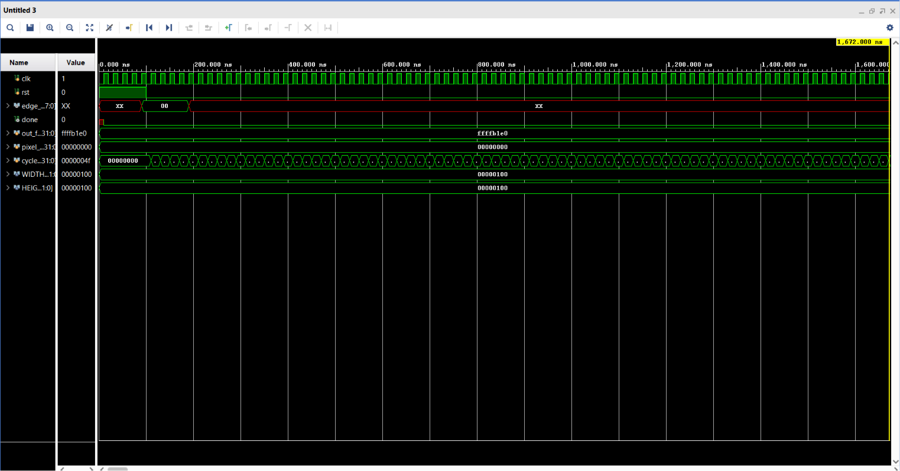
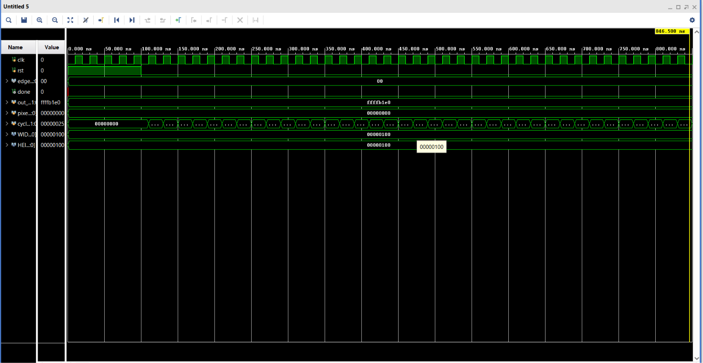
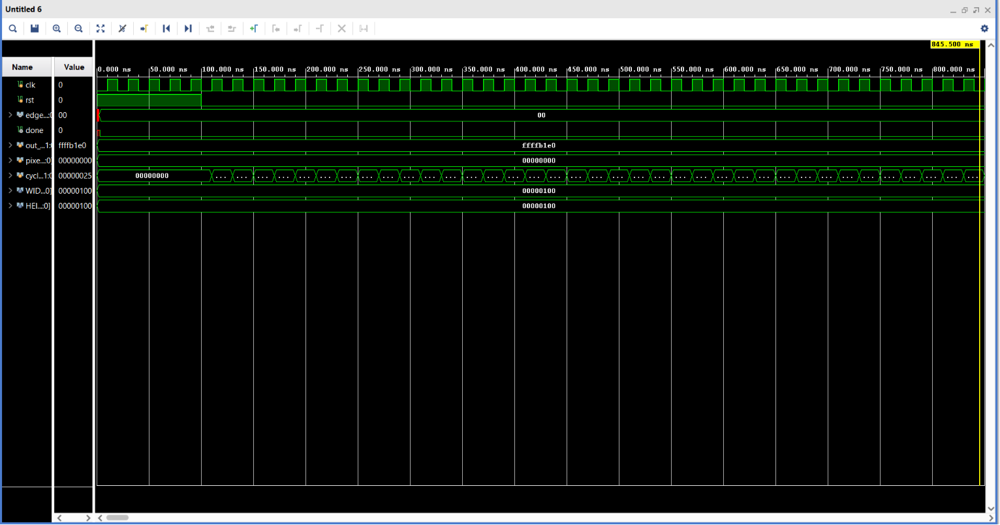
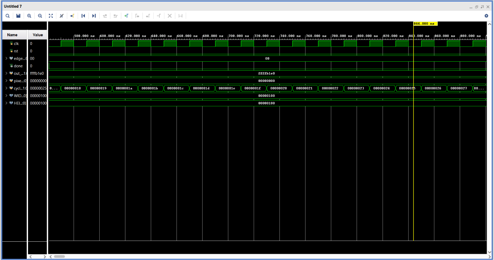
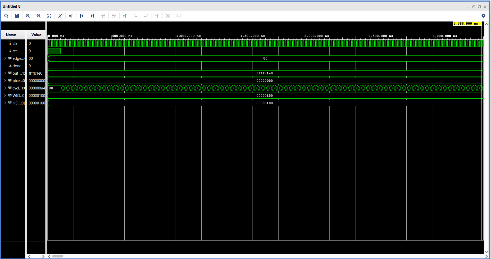

# 🚀 Verilog HDL Implementation of Hardware Accelerator for Sobel Edge Detection

A hardware implementation of the **Sobel Edge Detection Algorithm** using **Verilog HDL**. This project demonstrates how image edge detection can be accelerated using dedicated hardware instead of software processing. The design is developed in **Verilog HDL**, simulated using **Xilinx Vivado**, and verified through behavioral, post-synthesis, and post-implementation simulations.

---

# 📖 Overview

Edge detection is a fundamental operation in image processing and computer vision. In this project, the Sobel Edge Detection algorithm is implemented completely in hardware using Verilog HDL.

The input image is first converted into a memory file using Python. The hardware design processes the image through different RTL modules, computes horizontal and vertical gradients using the Sobel operator, and generates the final edge-detected image.

The project is verified through multiple simulation stages in Vivado.

---

# ✨ Features

- Verilog HDL implementation
- Sobel Edge Detection
- Modular RTL Design
- Vivado Behavioral Simulation
- Post-Synthesis Functional Simulation
- Post-Synthesis Timing Simulation
- Post-Implementation Functional Simulation
- Post-Implementation Timing Simulation
- Python-based Image Conversion

---

# 🛠️ Tools Used

- Verilog HDL
- Xilinx Vivado
- Python
- Git
- GitHub

---

# 🏗️ Hardware Flow

```
Input Image
      │
      ▼
Python Script
(Image → Memory)
      │
      ▼
input.mem
      │
      ▼
Image Loader
      │
      ▼
Line Buffer
      │
      ▼
Sobel Filter
      │
      ▼
Threshold
      │
      ▼
output.mem
      │
      ▼
Python Script
(Memory → Image)
      │
      ▼
Output Image
```

---

# 📂 Repository Structure

```
RTL/
Testbench/
Python/
Memory/
Images/
README.md
```

---

# ⚙️ RTL Modules

| Module | Description |
|---------|-------------|
| image_loader | Reads image pixels from memory |
| line_buffer | Generates a 3×3 sliding window |
| sobel_filter | Computes horizontal and vertical gradients |
| threshold | Produces the edge-detected output |
| top | Top-level module integrating all RTL blocks |
| tb_top | Testbench for simulation |

---

# 🧠 Sobel Operator

Horizontal Kernel (Gx)

```
-1  0 +1
-2  0 +2
-1  0 +1
```

Vertical Kernel (Gy)

```
+1 +2 +1
 0  0  0
-1 -2 -1
```

Edge Magnitude

```
|Gx| + |Gy|
```

---

# 📸 Results

## Original Input Image

<p align="center">

</p>

---

## Grayscale Image

The original RGB image is converted into grayscale before processing.

<p align="center">

</p>

---

## Behavioral Simulation

Behavioral simulation verifies the functionality of the RTL design before synthesis.

<p align="center">

</p>

---

## Post-Synthesis Functional Simulation

This simulation verifies that the synthesized netlist behaves correctly.

<p align="center">

</p>

---

## Post-Synthesis Timing Simulation

Timing simulation after synthesis validates that the design meets timing constraints.

<p align="center">

</p>

---

## Post-Implementation Functional Simulation

Functional verification after implementation.

<p align="center">

</p>

---

## Post-Implementation Timing Simulation

Final timing verification after place-and-route.

<p align="center">

</p>

---

## Final Edge Detection Output

The resulting edge-detected image generated by the Sobel hardware accelerator.

<p align="center">

</p>

---

# ▶️ How to Run

### Clone Repository

```bash
git clone https://github.com/Hanshitha07/Verilog-HDL-Implementation-of-Hardware-Accelerator-for-Sobel-Edge-Detection.git
```

### Convert Image

```bash
python image_to_mem.py
```

### Open Vivado

- Add RTL sources
- Add Testbench
- Run Behavioral Simulation
- Run Synthesis
- Run Implementation
- Generate Functional and Timing Simulations

### Convert Output

```bash
python mem_to_image.py
```

---

# 📊 Simulation Summary

| Simulation | Status |
|------------|--------|
| Behavioral Simulation | ✅ Passed |
| Post-Synthesis Functional | ✅ Passed |
| Post-Synthesis Timing | ✅ Passed |
| Post-Implementation Functional | ✅ Passed |
| Post-Implementation Timing | ✅ Passed |

---

# 🌍 Applications

- FPGA-based Image Processing
- Computer Vision
- Medical Imaging
- Autonomous Vehicles
- Robotics
- Surveillance Systems
- Industrial Inspection

---

# 🚀 Future Improvements

- Real-time FPGA implementation
- Video stream processing
- HDMI output support
- RGB image processing
- Hardware optimization for higher throughput

---

# 👩‍💻 Author

**Hanshitha Killi**

Computer and Communication Engineering

Amrita Vishwa Vidyapeetham

GitHub: https://github.com/Hanshitha07

---
